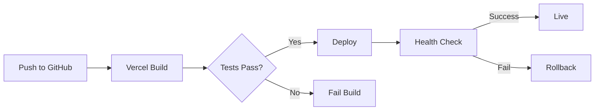

# ERPX-AI Deployment Guide

Complete guide for deploying ERPX-AI to production on Vercel with Supabase backend.

## Prerequisites

- Node.js 18+ installed
- pnpm installed (`npm install -g pnpm`)
- Supabase account and project
- Vercel account
- GitHub account

## Quick Start

### 1. Clone and Install

```bash
git clone https://github.com/isamiciari-cmd/erpx-ai.git
cd erpx-ai
pnpm install
```

### 2. Configure Environment

```bash
cp .env.example .env
```

Edit `.env` and add your Supabase credentials:

```env
VITE_SUPABASE_URL=https://your-project.supabase.co
VITE_SUPABASE_ANON_KEY=your-anon-key
```

### 3. Set Up Database

1. Go to Supabase Dashboard → SQL Editor
2. Run these scripts in order:
   - `database/01_schema.sql` - Core database schema
   - `database/02_rls_policies.sql` - Row Level Security
   - `database/03_seed_data.sql` - Initial data
   - `database/04_additional_setup.sql` - Users and roles

### 4. Test Locally

```bash
pnpm dev
```

Visit http://localhost:5173

**Test Credentials:**
- Admin: `admin-1@erpx-ai.com` / `@12345@`
- Cashier: `cashier@erpx-ai.com` / `Aa12141312@`

### 5. Deploy to Vercel

#### Option A: Vercel CLI

```bash
pnpm build                    # Test build locally
pnpm exec vercel             # Deploy to preview
pnpm exec vercel --prod      # Deploy to production
```

#### Option B: GitHub Integration

1. Push code to GitHub:
   ```bash
   git push origin main
   ```

2. Import project in Vercel:
   - Go to https://vercel.com/new
   - Import `isamiciari-cmd/erpx-ai`
   - Configure environment variables
   - Deploy

## Environment Variables

### Required for Production

```env
VITE_SUPABASE_URL=https://svxmlejmhlocsjjtftxd.supabase.co
VITE_SUPABASE_ANON_KEY=eyJhbGciOiJIUzI1NiIsInR5cCI6IkpXVCJ9...
```

Add these in Vercel:
- Dashboard → Settings → Environment Variables
- Add for: Production, Preview, Development

## Database Setup

### Initial Setup

1. **Create Supabase Project**
   - Go to https://supabase.com/dashboard
   - Click "New project"
   - Choose name, password, region
   - Wait for initialization (~2 minutes)

2. **Get Credentials**
   - Settings → API
   - Copy Project URL
   - Copy anon/public key

3. **Run Migrations**

```sql
-- 1. Core schema (tables, indexes)
\i database/01_schema.sql

-- 2. Security policies
\i database/02_rls_policies.sql

-- 3. Seed data (companies, roles, branches)
\i database/03_seed_data.sql

-- 4. Additional setup (admin, cashier users)
\i database/04_additional_setup.sql
```

### Enable Realtime

1. Supabase Dashboard → Database → Replication
2. Enable Realtime for these tables:
   - ✅ products
   - ✅ sales
   - ✅ shifts
   - ✅ inventory
   - ✅ invoices
   - ✅ users
   - ✅ customers

## Vercel Configuration

### Build Settings

```json
{
  "framework": "vite",
  "buildCommand": "pnpm build",
  "outputDirectory": "dist",
  "installCommand": "pnpm install"
}
```

### Domain Setup

1. Vercel Dashboard → Your Project → Settings → Domains
2. Add custom domain: `erpx-ai.com`
3. Configure DNS (provided by Vercel)
4. Enable automatic HTTPS

### Authentication URLs

Configure in Supabase Dashboard → Authentication → URL Configuration:

**Site URL:** `https://erpx-ai.com`

**Redirect URLs:**
```
https://erpx-ai.com/**
https://*.vercel.app/**
http://localhost:5173/**
```

## Continuous Deployment

### Automatic Deployment

Once connected to GitHub:
1. Push to `main` branch
2. Vercel auto-deploys
3. Preview deployments for PRs
4. Production deployment on merge

### Deployment Workflow



## Monitoring

### Health Checks

```bash
# Check deployment status
curl https://erpx-ai.com/health

# Check Supabase connection
curl https://svxmlejmhlocsjjtftxd.supabase.co/rest/v1/
```

### Error Tracking

- Vercel Dashboard → Logs
- Browser console (F12)
- Supabase Dashboard → Logs → Postgres/Realtime

## Troubleshooting

See [docs/troubleshooting/COMMON_ISSUES.md](troubleshooting/COMMON_ISSUES.md)

### Quick Fixes

**"Failed to fetch" error:**
```bash
# 1. Check environment variables in Vercel
# 2. Verify Supabase project is active
# 3. Check Supabase URL configuration
```

**Build fails:**
```bash
# Test build locally first
pnpm build

# Check build logs in Vercel
```

**Database connection issues:**
```bash
# Verify RLS policies are correct
# Check user permissions
# Enable Realtime for required tables
```

## Rollback Procedure

### Immediate Rollback

1. Vercel Dashboard → Deployments
2. Find last working deployment
3. Click "⋮" → "Promote to Production"

### Database Rollback

```bash
# Backup before changes
pg_dump > backup_before_migration.sql

# Rollback migration
\i database/rollback_scripts/rollback_xxx.sql
```

## Performance Optimization

### Recommended Settings

```typescript
// vite.config.ts
build: {
  rollupOptions: {
    output: {
      manualChunks: {
        'react-vendor': ['react', 'react-dom'],
        'ui-vendor': ['motion', 'lucide-react'],
        'supabase': ['@supabase/supabase-js'],
      }
    }
  },
  chunkSizeWarningLimit: 1000
}
```

### CDN Configuration

Enable on Vercel:
- Edge Network
- Automatic Static Optimization
- Image Optimization

## Security Checklist

- [ ] Environment variables not in source code
- [ ] RLS policies enabled on all tables
- [ ] HTTPS enforced
- [ ] Content Security Policy configured
- [ ] Regular security audits (`pnpm audit`)
- [ ] Secrets rotation schedule
- [ ] Access logs monitored

## Support

- **Documentation:** [docs/](../docs/)
- **Issues:** https://github.com/isamiciari-cmd/erpx-ai/issues
- **Supabase Support:** https://supabase.com/support

---

**Built with Vite + React + Supabase + Vercel**
